```{=html}
<!-- ── page-level styles ─────────────────────────────────────────── -->
<style>
  /* Category section headers */
  .dcc-category {
    font-size: 1.35rem;
    font-weight: 700;
    color: #8B1A2A;
    border-bottom: 2px solid #8B1A2A;
    margin-top: 2.5rem;
    margin-bottom: 1.25rem;
    padding-bottom: 0.3rem;
    letter-spacing: 0.02em;
  }

  /* Prompt badge beneath each card title */
  .dcc-prompt {
    display: inline-block;
    font-size: 0.68rem;
    font-weight: 600;
    color: #8B1A2A;
    background-color: #F5EEF0;
    border-radius: 3px;
    padding: 1px 6px;
    margin-bottom: 0.35rem;
    letter-spacing: 0.03em;
    text-transform: uppercase;
  }

  /* Card grid */
  .dcc-grid {
    display: grid;
    grid-template-columns: repeat(auto-fill, minmax(260px, 1fr));
    gap: 1.1rem;
    margin-bottom: 1rem;
  }

  /* Individual card */
  .dcc-card {
    border: 1px solid #e8e4dc;
    border-radius: 6px;
    overflow: hidden;
    background: #fafaf8;
    transition: box-shadow 0.18s ease, transform 0.18s ease;
    text-decoration: none;
    color: inherit;
    display: block;
  }
  .dcc-card:hover {
    box-shadow: 0 4px 18px rgba(139, 26, 42, 0.13);
    transform: translateY(-2px);
    text-decoration: none;
    color: inherit;
  }

  /* Thumbnail wrapper — fixed aspect ratio 4:3 */
  .dcc-thumb {
    width: 100%;
    aspect-ratio: 4 / 3;
    overflow: hidden;
    background: #f0ede8;
  }
  .dcc-thumb img {
    width: 100%;
    height: 100%;
    object-fit: cover;
    display: block;
    transition: transform 0.22s ease;
  }
  .dcc-card:hover .dcc-thumb img {
    transform: scale(1.03);
  }

  /* Card body */
  .dcc-body {
    padding: 0.7rem 0.85rem 0.85rem;
  }
  .dcc-title {
    font-size: 0.82rem;
    font-weight: 600;
    line-height: 1.35;
    color: #1a1a1a;
    margin: 0;
  }

  /* Intro block */
  .dcc-intro {
    background: #F5F3EE;
    border-left: 3px solid #8B1A2A;
    padding: 1rem 1.25rem;
    border-radius: 0 4px 4px 0;
    margin-bottom: 2rem;
    font-size: 0.92rem;
    line-height: 1.6;
    color: #333;
  }

  /* Stats row */
  .dcc-stats {
    display: flex;
    gap: 2rem;
    margin-bottom: 2rem;
    flex-wrap: wrap;
  }
  .dcc-stat {
    text-align: center;
  }
  .dcc-stat-num {
    font-size: 2rem;
    font-weight: 700;
    color: #8B1A2A;
    line-height: 1;
  }
  .dcc-stat-label {
    font-size: 0.75rem;
    color: #666;
    text-transform: uppercase;
    letter-spacing: 0.05em;
    margin-top: 0.2rem;
  }
</style>
```

::: {.dcc-intro}
Every April, the [#30DayChartChallenge](https://github.com/30DayChartChallenge/Edition2026) brings together practitioners from around the world to explore data through daily visualizations — one chart per day, guided by thematic prompts. This is my 2026 edition: 30 analytical charts, built entirely in R with ggplot2, across five categories. Each entry links to the full post with code, data sources, and methodology notes.
:::

```{=html}
<div class="dcc-stats">
  <div class="dcc-stat">
    <div class="dcc-stat-num">30</div>
    <div class="dcc-stat-label">Charts</div>
  </div>
  <div class="dcc-stat">
    <div class="dcc-stat-num">5</div>
    <div class="dcc-stat-label">Categories</div>
  </div>
  <div class="dcc-stat">
    <div class="dcc-stat-num">30</div>
    <div class="dcc-stat-label">Days</div>
  </div>
  <div class="dcc-stat">
    <div class="dcc-stat-num">R</div>
    <div class="dcc-stat-label">Built with</div>
  </div>
</div>
```

---

```{=html}
<!-- ══════════════════════════════════════════════════
     COMPARISONS  (Days 1–6)
     ══════════════════════════════════════════════════ -->
<div class="dcc-category">Comparisons &nbsp;<span style="font-weight:400;font-size:1rem;color:#888">· Days 01–06</span></div>

<div class="dcc-grid">

  <a class="dcc-card" href="30dcc_2026_01.html">
    <div class="dcc-thumb">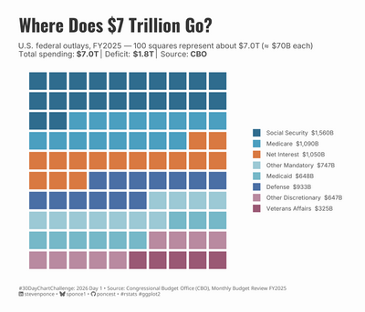</div>
    <div class="dcc-body">
      <div class="dcc-prompt">01 · Part-to-Whole</div>
      <p class="dcc-title">Where Does $7 Trillion Go?</p>
    </div>
  </a>

  <a class="dcc-card" href="30dcc_2026_02.html">
    <div class="dcc-thumb">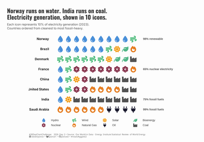</div>
    <div class="dcc-body">
      <div class="dcc-prompt">02 · Pictogram</div>
      <p class="dcc-title">Norway Runs on Water. India Runs on Coal.</p>
    </div>
  </a>

  <a class="dcc-card" href="30dcc_2026_03.html">
    <div class="dcc-thumb">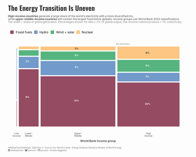</div>
    <div class="dcc-body">
      <div class="dcc-prompt">03 · Mosaic</div>
      <p class="dcc-title">The Energy Transition Is Uneven</p>
    </div>
  </a>

  <a class="dcc-card" href="30dcc_2026_04.html">
    <div class="dcc-thumb">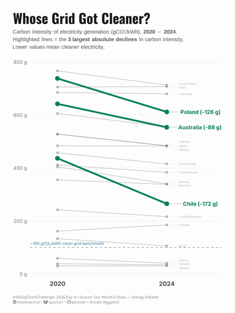</div>
    <div class="dcc-body">
      <div class="dcc-prompt">04 · Slope</div>
      <p class="dcc-title">Whose Grid Got Cleaner?</p>
    </div>
  </a>

  <a class="dcc-card" href="30dcc_2026_05.html">
    <div class="dcc-thumb">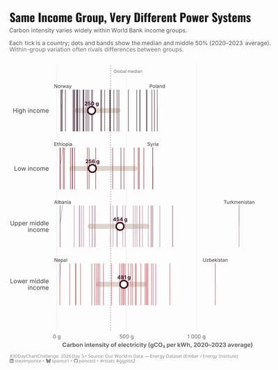</div>
    <div class="dcc-body">
      <div class="dcc-prompt">05 · Experimental</div>
      <p class="dcc-title">Same Income Group, Very Different Power Systems</p>
    </div>
  </a>

  <a class="dcc-card" href="30dcc_2026_06.html">
    <div class="dcc-thumb">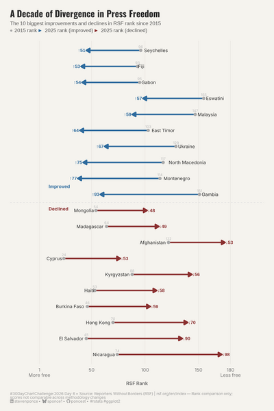</div>
    <div class="dcc-body">
      <div class="dcc-prompt">06 · RSF Data Day</div>
      <p class="dcc-title">A Decade of Divergence in Press Freedom</p>
    </div>
  </a>

</div>


<!-- ══════════════════════════════════════════════════
     DISTRIBUTIONS  (Days 7–12)
     ══════════════════════════════════════════════════ -->
<div class="dcc-category">Distributions &nbsp;<span style="font-weight:400;font-size:1rem;color:#888">· Days 07–12</span></div>

<div class="dcc-grid">

  <a class="dcc-card" href="30dcc_2026_07.html">
    <div class="dcc-thumb">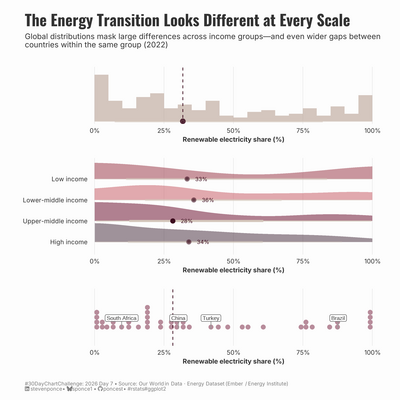</div>
    <div class="dcc-body">
      <div class="dcc-prompt">07 · Multiscale</div>
      <p class="dcc-title">The Energy Transition Looks Different at Every Scale</p>
    </div>
  </a>

  <a class="dcc-card" href="30dcc_2026_08.html">
    <div class="dcc-thumb">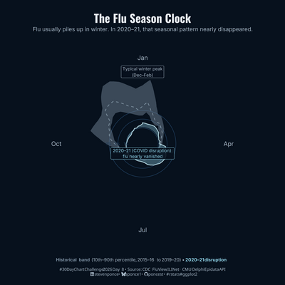</div>
    <div class="dcc-body">
      <div class="dcc-prompt">08 · Circular</div>
      <p class="dcc-title">The Flu Season Clock</p>
    </div>
  </a>

  <a class="dcc-card" href="30dcc_2026_09.html">
    <div class="dcc-thumb">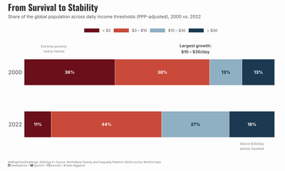</div>
    <div class="dcc-body">
      <div class="dcc-prompt">09 · Wealth</div>
      <p class="dcc-title">From Survival to Stability</p>
    </div>
  </a>

  <a class="dcc-card" href="30dcc_2026_10.html">
    <div class="dcc-thumb">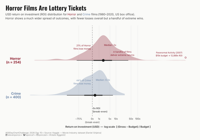</div>
    <div class="dcc-body">
      <div class="dcc-prompt">10 · Pop Culture</div>
      <p class="dcc-title">Horror Films Are Lottery Tickets</p>
    </div>
  </a>

  <a class="dcc-card" href="30dcc_2026_11.html">
    <div class="dcc-thumb">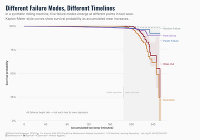</div>
    <div class="dcc-body">
      <div class="dcc-prompt">11 · Physical</div>
      <p class="dcc-title">Different Failure Modes, Different Timelines</p>
    </div>
  </a>

  <a class="dcc-card" href="30dcc_2026_12.html">
    <div class="dcc-thumb">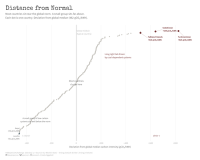</div>
    <div class="dcc-body">
      <div class="dcc-prompt">12 · FlowingData Theme Day</div>
      <p class="dcc-title">Distance from Normal</p>
    </div>
  </a>

</div>


<!-- ══════════════════════════════════════════════════
     RELATIONSHIPS  (Days 13–18)
     ══════════════════════════════════════════════════ -->
<div class="dcc-category">Relationships &nbsp;<span style="font-weight:400;font-size:1rem;color:#888">· Days 13–18</span></div>

<div class="dcc-grid">

  <a class="dcc-card" href="30dcc_2026_13.html">
    <div class="dcc-thumb">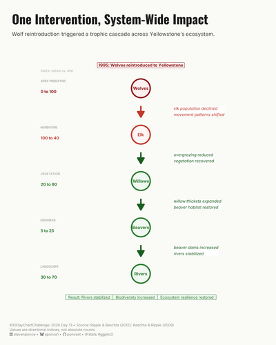</div>
    <div class="dcc-body">
      <div class="dcc-prompt">13 · Ecosystems</div>
      <p class="dcc-title">One Intervention, System-Wide Impact</p>
    </div>
  </a>

  <a class="dcc-card" href="30dcc_2026_14.html">
    <div class="dcc-thumb">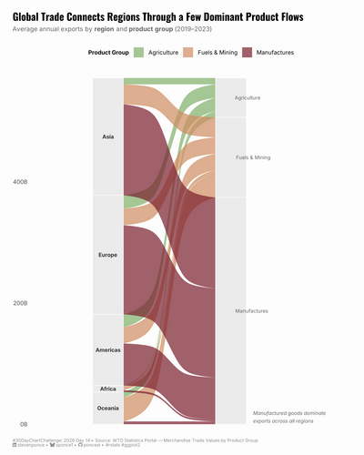</div>
    <div class="dcc-body">
      <div class="dcc-prompt">14 · Trade</div>
      <p class="dcc-title">Global Trade Connects Regions Through a Few Dominant Product Flows</p>
    </div>
  </a>

  <a class="dcc-card" href="30dcc_2026_15.html">
    <div class="dcc-thumb">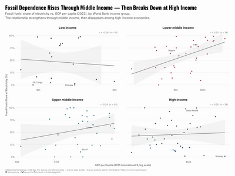</div>
    <div class="dcc-body">
      <div class="dcc-prompt">15 · Correlation</div>
      <p class="dcc-title">Fossil Dependence Rises Through Middle Income — Then Breaks Down at High Income</p>
    </div>
  </a>

  <a class="dcc-card" href="30dcc_2026_16.html">
    <div class="dcc-thumb">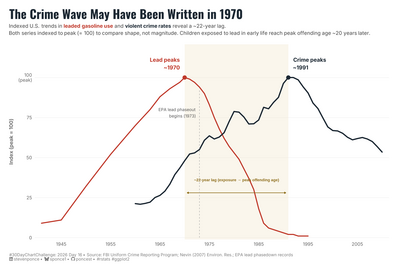</div>
    <div class="dcc-body">
      <div class="dcc-prompt">16 · Causation</div>
      <p class="dcc-title">The Crime Wave May Have Been Written in 1970</p>
    </div>
  </a>

  <a class="dcc-card" href="30dcc_2026_17.html">
    <div class="dcc-thumb">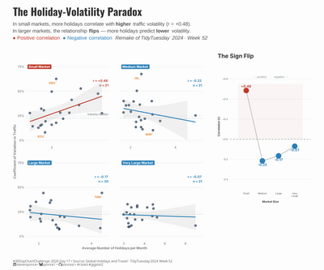</div>
    <div class="dcc-body">
      <div class="dcc-prompt">17 · Remake</div>
      <p class="dcc-title">The Holiday-Volatility Paradox</p>
    </div>
  </a>

  <a class="dcc-card" href="30dcc_2026_18.html">
    <div class="dcc-thumb">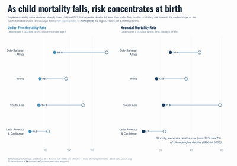</div>
    <div class="dcc-body">
      <div class="dcc-prompt">18 · UNICEF Data Day</div>
      <p class="dcc-title">As Child Mortality Falls, Risk Concentrates at Birth</p>
    </div>
  </a>

</div>


<!-- ══════════════════════════════════════════════════
     TIMESERIES  (Days 19–24)
     ══════════════════════════════════════════════════ -->
<div class="dcc-category">Timeseries &nbsp;<span style="font-weight:400;font-size:1rem;color:#888">· Days 19–24</span></div>

<div class="dcc-grid">

  <a class="dcc-card" href="30dcc_2026_19.html">
    <div class="dcc-thumb">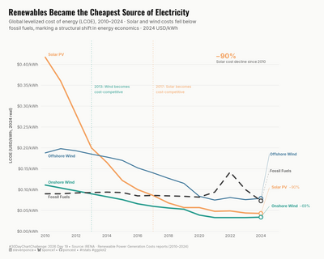</div>
    <div class="dcc-body">
      <div class="dcc-prompt">19 · Evolution</div>
      <p class="dcc-title">Renewables Became the Cheapest Source of Electricity</p>
    </div>
  </a>

  <a class="dcc-card" href="30dcc_2026_20.html">
    <div class="dcc-thumb">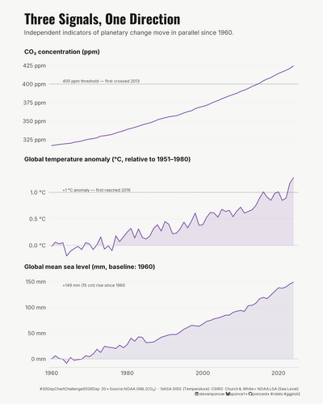</div>
    <div class="dcc-body">
      <div class="dcc-prompt">20 · Global Change</div>
      <p class="dcc-title">Three Signals, One Direction</p>
    </div>
  </a>

  <a class="dcc-card" href="30dcc_2026_21.html">
    <div class="dcc-thumb">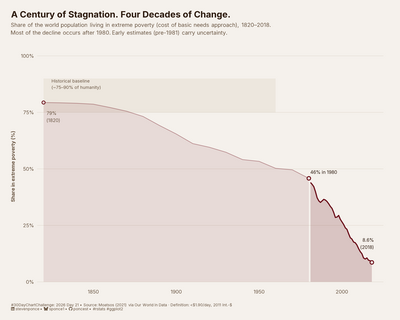</div>
    <div class="dcc-body">
      <div class="dcc-prompt">21 · Historical</div>
      <p class="dcc-title">A Century of Stagnation. Four Decades of Change.</p>
    </div>
  </a>

  <a class="dcc-card" href="30dcc_2026_22.html">
    <div class="dcc-thumb">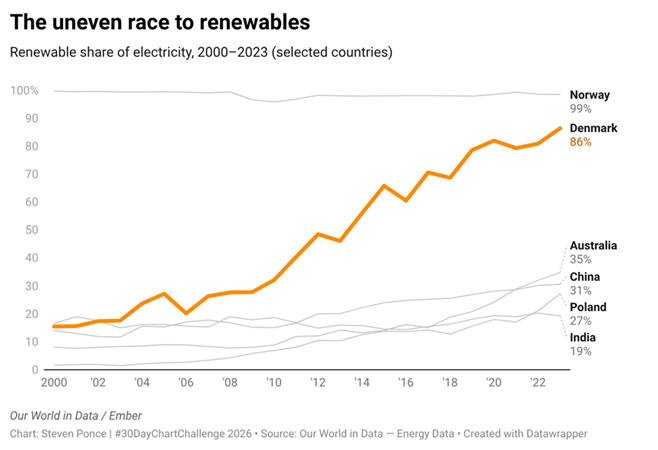</div>
    <div class="dcc-body">
      <div class="dcc-prompt">22 · New Tool</div>
      <p class="dcc-title">The Uneven Race to Renewables</p>
    </div>
  </a>

  <a class="dcc-card" href="30dcc_2026_23.html">
    <div class="dcc-thumb">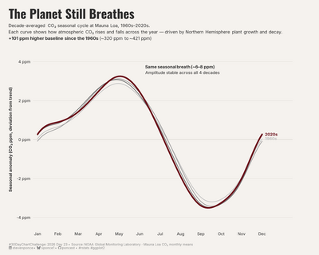</div>
    <div class="dcc-body">
      <div class="dcc-prompt">23 · Seasons</div>
      <p class="dcc-title">The Planet Still Breathes</p>
    </div>
  </a>

  <a class="dcc-card" href="30dcc_2026_24.html">
    <div class="dcc-thumb">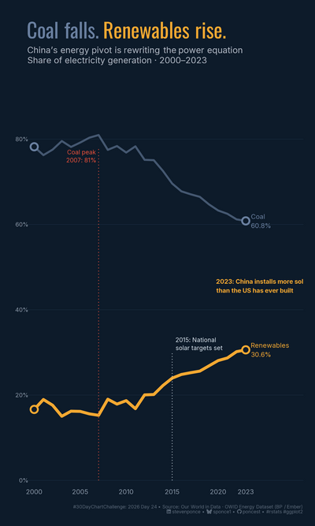</div>
    <div class="dcc-body">
      <div class="dcc-prompt">24 · SCMP Theme Day</div>
      <p class="dcc-title">Coal Falls. Renewables Rise.</p>
    </div>
  </a>

</div>


<!-- ══════════════════════════════════════════════════
     UNCERTAINTIES  (Days 25–30)
     ══════════════════════════════════════════════════ -->
<div class="dcc-category">Uncertainties &nbsp;<span style="font-weight:400;font-size:1rem;color:#888">· Days 25–30</span></div>

<div class="dcc-grid">

  <a class="dcc-card" href="30dcc_2026_25.html">
    <div class="dcc-thumb">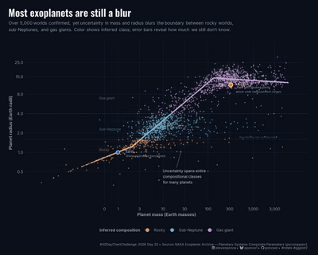</div>
    <div class="dcc-body">
      <div class="dcc-prompt">25 · Space</div>
      <p class="dcc-title">Most Exoplanets Are Still a Blur</p>
    </div>
  </a>

  <a class="dcc-card" href="30dcc_2026_26.html">
    <div class="dcc-thumb">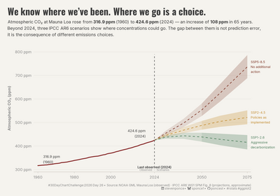</div>
    <div class="dcc-body">
      <div class="dcc-prompt">26 · Trend</div>
      <p class="dcc-title">We Know Where We've Been. Where We Go Is a Choice.</p>
    </div>
  </a>

  <a class="dcc-card" href="30dcc_2026_27.html">
    <div class="dcc-thumb">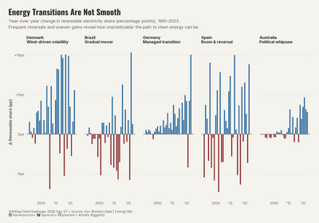</div>
    <div class="dcc-body">
      <div class="dcc-prompt">27 · Animation</div>
      <p class="dcc-title">Energy Transitions Are Not Smooth</p>
    </div>
  </a>

  <a class="dcc-card" href="30dcc_2026_28.html">
    <div class="dcc-thumb">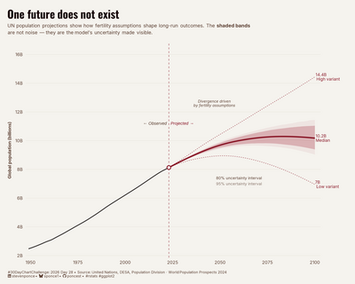</div>
    <div class="dcc-body">
      <div class="dcc-prompt">28 · Modeling</div>
      <p class="dcc-title">One Future Does Not Exist</p>
    </div>
  </a>

  <a class="dcc-card" href="30dcc_2026_29.html">
    <div class="dcc-thumb">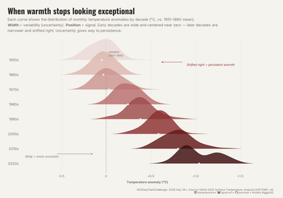</div>
    <div class="dcc-body">
      <div class="dcc-prompt">29 · Monochrome</div>
      <p class="dcc-title">When Warmth Stops Looking Exceptional</p>
    </div>
  </a>

  <a class="dcc-card" href="30dcc_2026_30.html">
    <div class="dcc-thumb">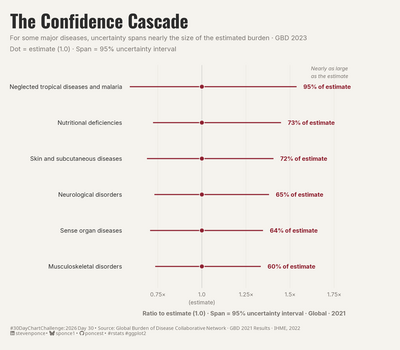</div>
    <div class="dcc-body">
      <div class="dcc-prompt">30 · GHDx Data Day</div>
      <p class="dcc-title">The Confidence Cascade</p>
    </div>
  </a>

</div>

<hr style="margin-top:3rem;border-color:#e0dbd4;">
<p style="font-size:0.78rem;color:#888;text-align:center;margin-top:1rem;">
  Built with R &amp; ggplot2 · Visualized by Steven Ponce · 
  <a href="https://github.com/poncest/personal-website" style="color:#8B1A2A;">GitHub</a>
</p>
```
