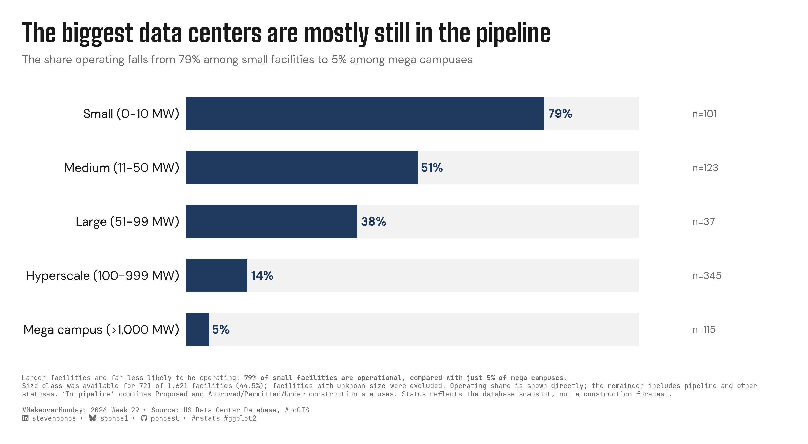

```{r}
#| label: setup-links
#| include: false

# CENTRALIZED LINK MANAGEMENT

## Project-specific info 
current_year <- 2026
current_week <- 29
project_file <- "mm_2026_29.qmd"
project_image <- "mm_2026_29.png"

## Data Sources
data_main <- "https://pub-cee805df54de4b6c8f93bee984e3c725.r2.dev/datasets/us-data-center-locations/Data_Centers_Database.xlsx"
data_secondary <- "https://pub-cee805df54de4b6c8f93bee984e3c725.r2.dev/datasets/us-data-center-locations/Data_Centers_Database.xlsx"

## Repository Links  
repo_main <- "https://github.com/poncest/personal-website/"
repo_file <- paste0("https://github.com/poncest/personal-website/blob/master/data_visualizations/MakeoverMonday/", current_year, "/", project_file)

## External Resources/Images
chart_original <- "https://raw.githubusercontent.com/poncest/MakeoverMonday/refs/heads/master/2026/Week_29_original_chart.png"

## Organization/Platform Links
org_primary <- "https://experience.arcgis.com/experience/5a4d072ad01449bba5698a80103fb909"
org_secondary <- "https://experience.arcgis.com/experience/5a4d072ad01449bba5698a80103fb909"

# Helper function to create markdown links
create_link <- function(text, url) {
  paste0("[", text, "](", url, ")")
}

# Helper function for citation-style links
create_citation_link <- function(text, url, title = NULL) {
  if (is.null(title)) {
    paste0("[", text, "](", url, ")")
  } else {
    paste0("[", text, "](", url, ' "', title, '")')
  }
}
```

### Original

The original visualization comes from `r create_link("US Data Center Locations", org_primary)`


### Makeover

{#fig-1}

### [**Steps to Create this Graphic**]{.mark}

#### [1. Load Packages & Setup]{.smallcaps}

```{r}
#| label: load
#| warning: false
#| message: false      
#| results: "hide"     

## 1. LOAD PACKAGES & SETUP ----
suppressPackageStartupMessages({
  if (!require("pacman")) install.packages("pacman")
  pacman::p_load(
    tidyverse, ggtext, showtext, scales, glue, janitor
)
})

### |- figure size ----
camcorder::gg_record(
  dir    = here::here("temp_plots"),
  device = "png",
  width  = 10,
  height = 5.5,
  units  = "in",
  dpi    = 320
)

# Source utility functions
suppressMessages(source(here::here("R/utils/fonts.R")))
source(here::here("R/utils/social_icons.R"))
source(here::here("R/utils/image_utils.R"))
source(here::here("R/themes/base_theme.R"))
```

#### [2. Read in the Data]{.smallcaps}

```{r}
#| label: read
#| include: true
#| eval: true
#| warning: false
#| 

df_raw <- readxl::read_excel(
  here::here("data/MakeoverMonday/2026/Data_Centers_Database.xlsx")) |>
  clean_names()
```

#### [3. Examine the Data]{.smallcaps}

```{r}
#| label: examine
#| include: true
#| eval: true
#| results: 'hide'
#| warning: false

glimpse(df_raw)
skimr::skim_without_charts(df_raw)
```

#### [4. Tidy Data]{.smallcaps}

```{r}
#| label: tidy
#| warning: false

### |- clean status / sizerank, collapse pipeline categories ----
df_tidy <- df_raw |>
  mutate(
    status = str_squish(status),
    sizerank = str_squish(sizerank),
    sizerank = if_else(
      sizerank == "Hyperscale (101-999 MW)",
      "Hyperscale (100-999 MW)",
      sizerank
    )
  ) |>
  filter(sizerank != "Unknown") |>
  mutate(
    status_bucket = case_when(
      status == "Operating" ~ "Operating",
      status %in% c("Proposed", "Approved/Permitted/Under construction") ~ "In pipeline",
      TRUE ~ "Stalled/Other"
    ),
    sizerank = factor(
      sizerank,
      levels = c(
        "Small (0-10 MW)",
        "Medium (11-50 MW)",
        "Large (51-99 MW)",
        "Hyperscale (100-999 MW)",
        "Mega campus (>1,000 MW)"
      )
    )
  )

### |- summarize: % operating by size class ----
plot_data <- df_tidy |>
  summarise(
    n           = n(),
    n_operating = sum(status_bucket == "Operating"),
    .by = sizerank
  ) |>
  mutate(
    pct_operating = n_operating / n * 100,
    label_pct     = paste0(round(pct_operating), "%"),
    label_n       = paste0("n=", n)
  ) |>
  arrange(sizerank) |>
  ungroup()  
```

#### [5. Visualization Parameters]{.smallcaps}

```{r}
#| label: params
#| include: true
#| warning: false

### |- plot aesthetics ----
clrs <- get_theme_colors(
  palette = list(
    accent     = "#1E3A5F",
    track      = "#F2F2F2",
    text       = "#1A1A1A",
    muted      = "#6B6B6B",
    background = "#FFFFFF"
  )
)$palette

### |- annotation / layout scalars ----
n_known      <- nrow(df_tidy)
n_total      <- nrow(df_raw)
pct_known    <- round(n_known / n_total * 100, 1)

track_max    <- 100
n_label_x    <- 112
x_axis_max   <- 130
bar_width    <- 0.62

### |- titles and caption ----
title_text <- "The biggest data centers are mostly still in the pipeline"

subtitle_text <- glue(
  "The share operating falls from {round(plot_data$pct_operating[plot_data$sizerank == 'Small (0-10 MW)'])}% ",
  "among small facilities to {round(plot_data$pct_operating[plot_data$sizerank == 'Mega campus (>1,000 MW)'])}% ",
  "among mega campuses"
)

caption_lead <- glue(
  "Larger facilities are far less likely to be operating: **",
  "{round(plot_data$pct_operating[plot_data$sizerank == 'Small (0-10 MW)'])}% of small ",
  "facilities are operational, compared with just ",
  "{round(plot_data$pct_operating[plot_data$sizerank == 'Mega campus (>1,000 MW)'])}% ",
  "of mega campuses.**"
)

caption_note <- glue(
  "Size class was available for {n_known} of {scales::comma(n_total)} facilities ",
  "({pct_known}%); facilities with unknown size were excluded. Operating share is shown ",
  "directly; the remainder includes pipeline and other statuses. \u2018In pipeline\u2019 combines ",
  "Proposed and Approved/Permitted/Under\u00A0construction statuses. Status reflects the database ",
  "snapshot, not a construction forecast.<br>"
)

caption_text <- glue(
  "{caption_lead}<br>",
  "{caption_note}<br>",
  create_mm_caption(
    mm_year = 2026,
    mm_week = 29,
    source_text = "US Data Center Database, ArcGIS"
  )
)

### |- fonts ----
setup_fonts()
fonts <- get_font_families()

### |- plot theme ----
base_theme <- create_base_theme(clrs)

weekly_theme <- extend_weekly_theme(
  base_theme,
  theme(
    plot.background = element_rect(fill = clrs$background, color = NA),
    panel.background = element_rect(fill = clrs$background, color = NA),
    panel.grid = element_blank(),
    axis.title = element_blank(),
    axis.text.x = element_blank(),
    axis.ticks = element_blank(),
    axis.text.y = element_text(
      family = fonts$text, color = clrs$text, size = 11, hjust = 1
    ),
    plot.title = element_text(
      family = fonts$title_1, color = clrs$text, size = 22, face = "bold"
    ),
    plot.subtitle = element_text(
      family = fonts$subtitle, color = clrs$muted, size = 10,
      margin = margin(b = 14)
    ),
    plot.caption = element_textbox_simple(
      family = fonts$caption, color = clrs$muted, size = 6,
      margin = margin(t = 12)
    ),
    plot.margin = margin(20, 30, 20, 20)
  )
)

theme_set(weekly_theme)

```

#### [6. Plot]{.smallcaps}

```{r}
#| label: plot
#| warning: false

### |- plot ----
p <- ggplot(plot_data, aes(y = sizerank)) +
  geom_col(
    aes(x = track_max),
    fill  = clrs$track,
    width = bar_width
  ) +
  geom_col(
    aes(x = pct_operating),
    fill  = clrs$accent,
    width = bar_width
  ) +
  geom_text(
    aes(x = pct_operating, label = label_pct),
    hjust = -0.18,
    size = 3.6,
    fontface = "bold",
    color = clrs$accent,
    family = fonts$text
  ) +
  geom_text(
    aes(x = n_label_x, label = label_n),
    hjust = 0,
    size = 3.2,
    color = clrs$muted,
    family = fonts$text
  ) +
  scale_y_discrete(limits = rev) +
  scale_x_continuous(
    limits = c(0, x_axis_max),
    expand = c(0, 0)
  ) +
  labs(
    title = title_text,
    subtitle = subtitle_text,
    caption = caption_text
  )
```

#### [7. Save]{.smallcaps}

```{r}
#| label: save
#| warning: false

### |-  plot image ----  
save_plot(
  plot = p, 
  type = "makeovermonday", 
  year = current_year,
  week = current_week,
  width = 10, 
  height = 5.5
  )
```

#### [8. Session Info]{.smallcaps}

::: {.callout-tip collapse="true"}
##### Expand for Session Info

```{r, echo = FALSE}
#| eval: true
#| warning: false

sessionInfo()
```
:::

#### [9. GitHub Repository]{.smallcaps}

::: {.callout-tip collapse="true"}
##### Expand for GitHub Repo

The complete code for this analysis is available in `r create_link(project_file, repo_file)`.

For the full repository, `r create_link("click here", repo_main)`.
:::

#### [10. References]{.smallcaps}
::: {.callout-tip collapse="true"}
##### Expand for References
**Primary Data (Makeover Monday):**
1. Makeover Monday `r current_year` Week `r current_week`: `r create_link("US Data Center Locations", "https://experience.arcgis.com/experience/5a4d072ad01449bba5698a80103fb909")`
   - Excel: 1,621 rows × 44 columns. Each record represents a single U.S. data center facility, with fields covering location, development status, size classification, reported power capacity (MW), operator, cooling infrastructure, and documented community pushback.
   - The original Esri/ArcGIS dashboard presents facilities as clustered map markers labeled only by raw facility count. This makeover instead asks a maturity question: how does the share of facilities actually operating change as project size increases?
   - Analysis was restricted to the 721 of 1,621 facilities (44.5%) with a known `sizerank` classification; facilities coded `"Unknown"` size were excluded rather than imputed. A near-duplicate size-label entry (`"Hyperscale (101-999 MW)"`, n=1) was merged into `"Hyperscale (100-999 MW)"` prior to analysis.
2. Original Chart: `r create_link("US Data Center Locations dashboard", "https://experience.arcgis.com/experience/5a4d072ad01449bba5698a80103fb909")` — Esri / ArcGIS
   - An interactive clustered map showing facility count totals as circle labels at varying zoom levels, with no encoding for development status, size, or ownership.
   - This makeover asks a different question: rather than showing *where* facilities are located, it examines *how mature* facility development is (operating vs. still in the pipeline) as project size class increases.

**Source Data:**
3. `r create_link("US Data Center Database", "https://pub-cee805df54de4b6c8f93bee984e3c725.r2.dev/datasets/us-data-center-locations/Data_Centers_Database.xlsx")`
   - The database tracks individual U.S. data center facilities — proposed, under construction, operating, suspended, and cancelled — compiled from media monitoring and public records.
   - This visualization uses only the `status` and `sizerank` fields. Facility-level fields such as operator name, power source, and community pushback were reviewed during exploratory analysis but are not shown in the published chart.

**Methodological Notes:**
4. Development status was grouped from the source's seven `status` categories for the caption text (not shown as a separate visual encoding in the final chart):
   - **Operating:** Operating
   - **In pipeline:** Proposed + Approved/Permitted/Under construction
   - **Stalled/Other:** Cancelled + Suspended + Expanding + Pre-proposal
   - The chart encodes Operating share directly; the gray remainder includes both pipeline and stalled/other statuses and should not be read as "100% − Operating = Pipeline."
5. Size class (`sizerank`) is a source-published categorical field, not independently recomputed from reported megawatt (`mw`) capacity. Reported `mw` was missing for 62% of facilities overall, while `sizerank` was populated independently for a minority of those cases — `sizerank` was therefore used as the sole size-grouping variable rather than deriving classes from `mw` directly.
:::

#### [11. Custom Functions Documentation]{.smallcaps}

::: {.callout-note collapse="true"}
##### 📦 Custom Helper Functions

This analysis uses custom functions from my personal module library for efficiency and consistency across projects.

**Functions Used:**

-   **`fonts.R`**: `setup_fonts()`, `get_font_families()` - Font management with showtext
-   **`social_icons.R`**: `create_social_caption()` - Generates formatted social media captions
-   **`image_utils.R`**: `save_plot()` - Consistent plot saving with naming conventions
-   **`base_theme.R`**: `create_base_theme()`, `extend_weekly_theme()`, `get_theme_colors()` - Custom ggplot2 themes

**Why custom functions?**\
These utilities standardize theming, fonts, and output across all my data visualizations. The core analysis (data tidying and visualization logic) uses only standard tidyverse packages.

**Source Code:**\
View all custom functions → [GitHub: R/utils](https://github.com/poncest/personal-website/tree/master/R)
:::
