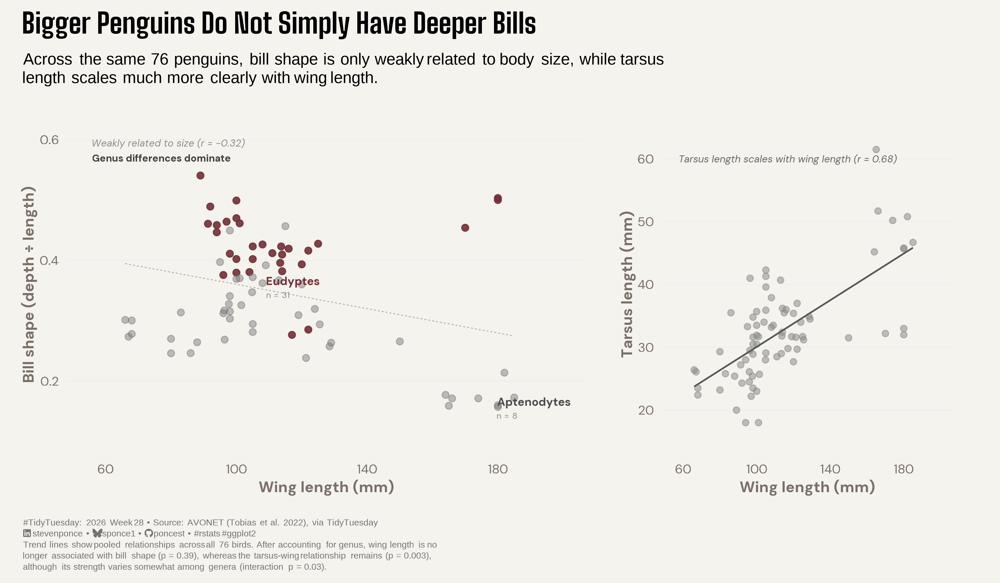

{#fig-1}

### [**Steps to Create this Graphic**]{.mark}

#### [1. Load Packages & Setup]{.smallcaps}

```{r}
#| label: load
#| warning: false
#| message: false      
#| results: "hide"     

## 1. LOAD PACKAGES & SETUP ----
suppressPackageStartupMessages({
if (!require("pacman")) install.packages("pacman")
pacman::p_load(
    tidyverse, ggtext, showtext, janitor, ggrepel,      
    scales, glue, skimr, patchwork
    )
})

### |- figure size ----          
camcorder::gg_record(
  dir    = here::here("temp_plots"),
    device = "png",
    width  = 12,
    height = 7,
    units  = "in",
    dpi    = 320
)

# Source utility functions
suppressMessages(source(here::here("R/utils/fonts.R")))
source(here::here("R/utils/social_icons.R"))
source(here::here("R/utils/image_utils.R"))
source(here::here("R/themes/base_theme.R"))
```

#### [2. Read in the Data]{.smallcaps}

```{r}
#| label: read
#| include: true
#| eval: true
#| warning: false

## 2. READ IN THE DATA ----
tt <- tidytuesdayR::tt_load(2026, week = 28)
many_penguins <- tt$many_penguins |> clean_names()
rm(tt)
```

#### [3. Examine the Data]{.smallcaps}

```{r}
#| label: examine
#| include: true
#| eval: true
#| results: 'hide'
#| warning: false

glimpse(many_penguins)
```

#### [4. Tidy Data]{.smallcaps}

```{r}
#| label: tidy
#| warning: false

penguins_shape <- many_penguins |>
  mutate(
    beak_shape_ratio = beak_depth / beak_length_culmen,
    is_highlight = genus == "Eudyptes"
  ) |>
  filter(
    !is.na(beak_shape_ratio),
    !is.na(wing_length),
    !is.na(tarsus_length)
  )

### |- genus cluster centers for direct labeling ----
genus_summary <- penguins_shape |>
  summarise(
    x_mean = mean(wing_length),
    y_mean = mean(beak_shape_ratio),
    n = n(),
    .by = genus
  ) |>
  arrange(desc(y_mean)) |>
  mutate(is_highlight = genus == "Eudyptes")

# Label only the two anchors
genus_labels <- genus_summary |>
  filter(genus %in% c("Eudyptes", "Aptenodytes")) |>
  mutate(
    label_x = case_when(
      genus == "Eudyptes" ~ 108,
      genus == "Aptenodytes" ~ x_mean + 4
    ),
    label_y = case_when(
      genus == "Eudyptes" ~ 0.355,
      genus == "Aptenodytes" ~ y_mean - 0.018
    )
  )

### |- correlation annotations
r_shape <- cor(penguins_shape$wing_length, penguins_shape$beak_shape_ratio) |> round(2)
r_tarsus <- cor(penguins_shape$wing_length, penguins_shape$tarsus_length) |> round(2)
n_total <- nrow(penguins_shape)
```

#### [5. Visualization Parameters]{.smallcaps}

```{r}
#| label: params
#| include: true
#| warning: false

### |- plot aesthetics ----
clrs <- get_theme_colors(
  palette = c("highlight" = "#722F37", "muted" = "gray70", "control" = "gray55")
)

### |- titles and caption ----
title_text <- str_glue("Bigger Penguins Do Not Simply Have Deeper Bills")

subtitle_text <- str_glue(
  "Across the same 76 penguins, bill shape is only weakly related to body ",
  "size, while tarsus length scales much more clearly with wing length."
) |>
  str_wrap(width = 95) |>
  str_replace_all("\n", "<br>")

caption_text <- str_glue(
  "{create_social_caption(tt_year = 2026, tt_week = 28, source_text = 'AVONET (Tobias et al. 2022), via TidyTuesday')}<br>",
  "{str_wrap(
    paste(
      'Trend lines show pooled relationships across all 76 birds. After accounting',
      'for genus, wing length is no longer associated with bill shape (p = 0.39),',
      'whereas the tarsus-wing relationship remains (p = 0.003), although its',
      'strength varies somewhat among genera (interaction p = 0.03).'
    ),
    width = 110
  ) |> str_replace_all('\n', '<br>')}"
)

### |- fonts ----
setup_fonts()
fonts <- get_font_families()

### |- plot theme ----
base_theme <- create_base_theme(clrs)

weekly_theme <- extend_weekly_theme(
  base_theme,
  theme(
    plot.title = element_text(
      face = "bold", size = rel(1.7), family = fonts$title_1
    ),
    plot.subtitle = element_markdown(
      size = rel(1.0), family = 'sans', lineheight = 1.15,
      margin = margin(t = 4, b = 12)
    ),
    plot.caption = element_markdown(
      size = rel(0.55), family = 'sans', color = "gray45",
      lineheight = 1.25, hjust = 0,
      margin = margin(t = 10)
    ),
    panel.grid.major.y = element_line(color = "gray93", linewidth = 0.25),
    panel.grid.major.x = element_blank(),
    panel.grid.minor = element_blank(),
    axis.ticks = element_blank(),
    legend.position = "none",
    plot.margin = margin(t = 10, r = 20, b = 10, l = 10)
  )
)

theme_set(weekly_theme)
```

#### [6. Plot]{.smallcaps}

```{r}
#| label: plot
#| warning: false

### |- plot ----

### |- panel A: bill shape ratio vs wing length ----
p_shape <- ggplot(penguins_shape, aes(x = wing_length, y = beak_shape_ratio)) +
  geom_point(
    aes(color = is_highlight, alpha = is_highlight),
    size = 2.4
  ) +
  geom_smooth(
    method = "lm", se = FALSE, color = "gray70",
    linewidth = 0.4, linetype = "22"
  ) +
  geom_richtext(
    data = genus_labels,
    aes(
      x = label_x, y = label_y,
      label = glue(
        "<span style='font-size:10pt;color:{ifelse(is_highlight, \"#722F37\", \"gray30\")}'>",
        "<b>{genus}</b></span><br>",
        "<span style='font-size:7.5pt;color:gray55'>n = {n}</span>"
      )
    ),
    hjust = 0, vjust = 0.5, lineheight = 1.0,
    family = fonts$text,
    fill = NA, label.color = NA,
    show.legend = FALSE
  ) +
  scale_color_manual(values = c("TRUE" = "#722F37", "FALSE" = "gray45")) +
  scale_alpha_manual(values = c("TRUE" = 0.9, "FALSE" = 0.45)) +
  scale_x_continuous(limits = c(55, 200), breaks = seq(60, 200, 40)) +
  scale_y_continuous(limits = c(0.1, 0.62), labels = label_number(accuracy = 0.1)) +
  labs(
    title = NULL,
    x = "Wing length (mm)",
    y = "Bill shape (depth \u00f7 length)"
  ) +
  annotate(
    "text",
    x = 56, y = 0.60,
    label = "Weakly related to size (r = -0.32)",
    hjust = 0, vjust = 1, size = 3, color = "gray55", fontface = "italic",
    family = fonts$text
  ) +
  annotate(
    "text",
    x = 56, y = 0.575,
    label = "Genus differences dominate",
    hjust = 0, vjust = 1, size = 3, color = "gray25", fontface = "bold",
    family = fonts$text
  )

### |- panel B: tarsus length vs wing length ----
p_control <- ggplot(penguins_shape, aes(x = wing_length, y = tarsus_length)) +
  geom_point(color = "gray55", alpha = 0.55, size = 2.2) +
  geom_smooth(
    method = "lm", se = FALSE, color = "gray35",
    linewidth = 0.7
  ) +
  scale_x_continuous(limits = c(55, 200), breaks = seq(60, 200, 40)) +
  scale_y_continuous(limits = c(15, 65)) +
  labs(
    title = NULL,
    x = "Wing length (mm)",
    y = "Tarsus length (mm)"
  ) +
  annotate(
    "text",
    x = 58, y = 60,
    label = glue("Tarsus length scales with wing length (r = {r_tarsus})"),
    hjust = 0, size = 3, color = "gray40", fontface = "italic",
    family = fonts$text, lineheight = 0.9
  )

### |- compose with patchwork  ----
combined_plot <- p_shape + p_control +
  plot_layout(widths = c(1.28, 0.72)) +
  plot_annotation(
    title = title_text,
    subtitle = subtitle_text,
    caption = caption_text,
    theme = weekly_theme
  )
```

#### [7. Save]{.smallcaps}

```{r}
#| label: save
#| warning: false

### |-  plot image ----  
save_plot_patchwork(
  plot = combined_plot, 
  type = "tidytuesday", 
  year = 2026, 
  week = 28, 
  width  = 12,
  height = 7
  )
```

#### [8. Session Info]{.smallcaps}

::: {.callout-tip collapse="true"}
##### Expand for Session Info

```{r, echo = FALSE}
#| eval: true
#| warning: false

sessionInfo()
```
:::

#### [9. GitHub Repository]{.smallcaps}

::: {.callout-tip collapse="true"}
##### Expand for GitHub Repo

The complete code for this analysis is available in [`tt_2026_28.qmd`](https://github.com/poncest/personal-website/blob/master/data_visualizations/TidyTuesday/2026/tt_2026_28.qmd).

For the full repository, [click here](https://github.com/poncest/personal-website/).
:::

#### [10. References]{.smallcaps}

::: {.callout-tip collapse="true"}
##### Expand for References
1.  **Data Source:**
    -   TidyTuesday 2026 Week 28: [Many Penguins](https://github.com/rfordatascience/tidytuesday/blob/main/data/2026/2026-07-14/readme.md)

:::


#### [11. Custom Functions Documentation]{.smallcaps}

::: {.callout-note collapse="true"}
##### 📦 Custom Helper Functions

This analysis uses custom functions from my personal module library for efficiency and consistency across projects.

**Functions Used:**

-   **`fonts.R`**: `setup_fonts()`, `get_font_families()` - Font management with showtext
-   **`social_icons.R`**: `create_social_caption()` - Generates formatted social media captions
-   **`image_utils.R`**: `save_plot()` - Consistent plot saving with naming conventions
-   **`base_theme.R`**: `create_base_theme()`, `extend_weekly_theme()`, `get_theme_colors()` - Custom ggplot2 themes

**Why custom functions?**\
These utilities standardize theming, fonts, and output across all my data visualizations. The core analysis (data tidying and visualization logic) uses only standard tidyverse packages.

**Source Code:**\
View all custom functions → [GitHub: R/utils](https://github.com/poncest/personal-website/tree/master/R)
:::
